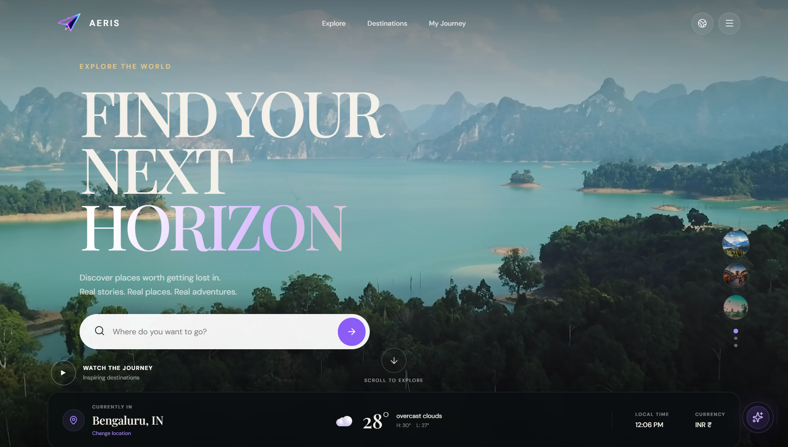
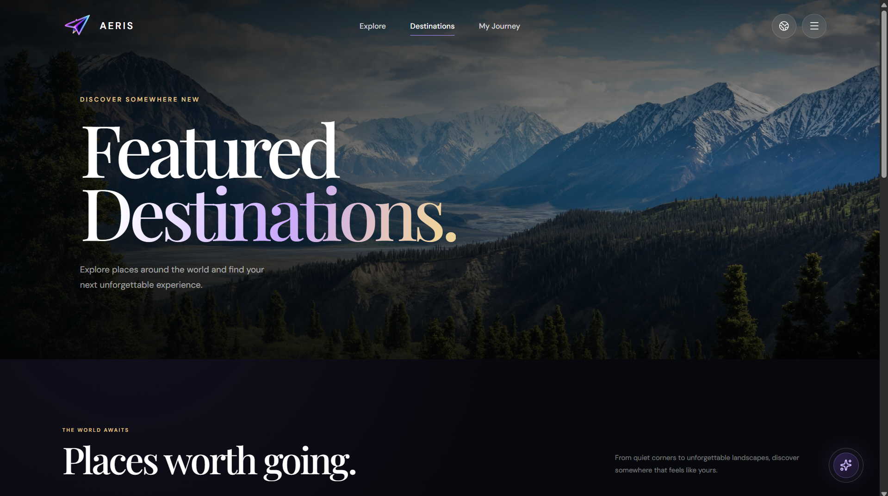
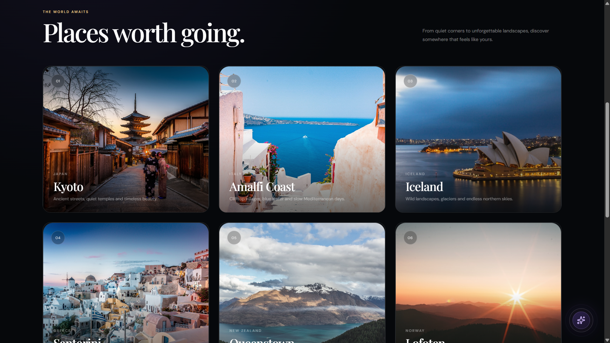
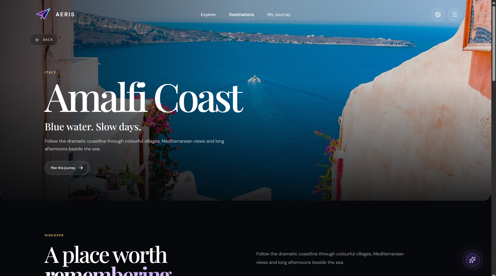
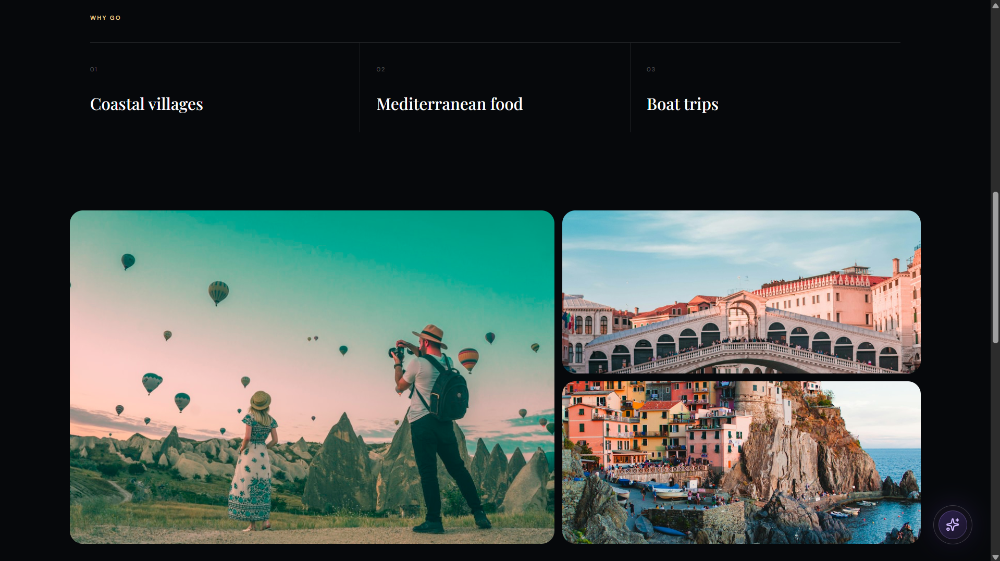
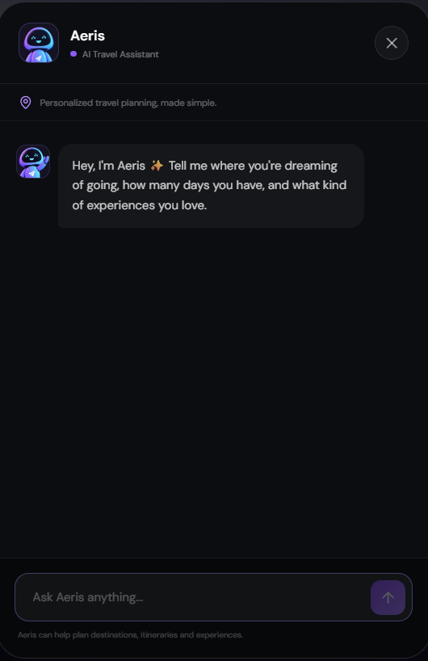
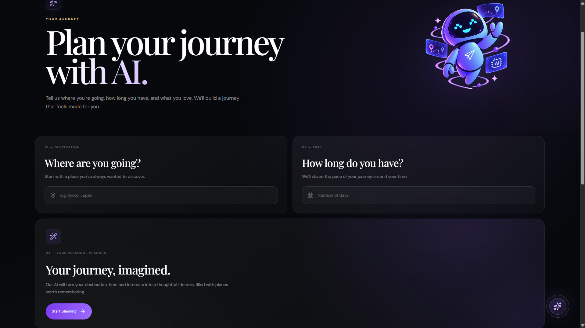

<p align="center">
  
</p>

<h1 align="center"> Aeris — AI-Powered Travel Explorer</h1>

> **Aeris** is a modern travel web application built with React that
> helps users discover destinations, explore famous places, check
> real-time weather, and plan trips with the help of an AI travel
> assistant.

##  Overview

Aeris is designed as a clean, design-led travel experience rather than a
traditional travel directory. Users can explore destinations around the
world, open dedicated destination pages, view notable places, check live
weather, and use **Aeris AI** to get travel guidance and generate
readable day-by-day itineraries.

The project was built for the **Designesthetics Front-End Developer
Assignment**, with a strong focus on visual design, interaction,
responsiveness, accessibility, API integration, and handling real-world
loading/error states.

------------------------------------------------------------------------

##  Features

### Landing Experience

-   Full-screen travel-focused hero section
-   Immersive visual presentation
-   Clear calls-to-action for discovering destinations
-   Responsive navigation and layout

### Destination Explorer

-   Browse travel destinations
-   Search destinations
-   Filter and explore destination cards
-   Dedicated destination detail pages
-   Destination information presented in a structured layout

###  Location Awareness

-   Uses the visitor's location when permission is granted
-   Supports manually searching/selecting a location
-   Designed to remain useful when location permission is denied

###  Real-Time Weather

-   Live weather information for selected locations
-   Current temperature and weather condition
-   Feels-like temperature and related weather information
-   Weather data retrieved through an external API

###  Aeris AI Travel Assistant

-   Conversational AI travel assistant
-   Answers destination-related questions
-   Helps users decide:
    -   How long to stay
    -   What to see
    -   When to visit
    -   What to include in a trip

###  Responsive Design

-   Mobile-friendly
-   Tablet-friendly
-   Desktop and large-screen layouts
-   Responsive navigation, cards, sections, chatbot and itinerary views

###  Accessibility & UX

-   Semantic HTML where appropriate
-   Keyboard-friendly interactions
-   Readable typography and contrast
-   Designed loading, empty, denied-permission and failed-request states
-   Hover and transition effects used intentionally

------------------------------------------------------------------------

##  Tech Stack

  Technology                      Purpose
  ------------------------------- ----------------------------------------------
  **React**                       Front-end application
  **Vite**                        Development and build tooling
  **JavaScript (JSX)**            Application logic and UI
  **CSS3**                        Styling, responsive layouts and animations
  **Lucide React**                Interface icons
  **Framer Motion**               Motion and UI transitions
  **Node.js / Express**           Backend/API layer
  **OpenWeather**                 Real-time weather data
  **Google Gemini**               AI travel assistant and itinerary generation
  **Render **                     Deployment

------------------------------------------------------------------------

##  Project Structure

``` text
Aeris/
│
├── public/
│
├── server/
│   └── server.js
│
├── src/
│   ├── assets/
│   │   ├── AI.png
│   │   ├── AIChat.png
│   │   ├── AIprofile.png
│   │   ├── compass.png
│   │   ├── hero.png
│   │   ├── logo.png
│   │   └── madeforyou.png
│   │
│   ├── components/
│   │   ├── FloatingAI/
│   │   │   ├── FloatingAI.css
│   │   │   └── FloatingAI.jsx
│   │   ├── AerisChatBot.css
│   │   ├── AerisChatBot.jsx
│   │   ├── AIPlanner.css
│   │   ├── AIPlanner.jsx
│   │   ├── FeaturedDestinations.css
│   │   ├── FeaturedDestinations.jsx
│   │   ├── Footer.css
│   │   ├── Footer.jsx
│   │   ├── Hero.css
│   │   ├── Hero.jsx
│   │   ├── Navbar.css
│   │   ├── Navbar.jsx
│   │   ├── WhyTravelWithUs.css
│   │   └── WhyTravelWithUs.jsx
│   │
│   ├── pages/
│   │   ├── DestinationDetail.css
│   │   ├── DestinationDetail.jsx
│   │   ├── Destinations.css
│   │   ├── Destinations.jsx
│   │   ├── Explore.css
│   │   ├── Explore.jsx
│   │   ├── Home.jsx
│   │   ├── Journey.css
│   │   └── Journey.jsx
│   │
│   ├── App.css
│   ├── App.jsx
│   ├── index.css
│   └── main.jsx
│
├── .env
├── .gitignore
├── eslint.config.js
├── index.html
├── package.json
├── package-lock.json
├── README.md
└── vite.config.js
```

------------------------------------------------------------------------

##  APIs & External Services

###  OpenWeather

Used to retrieve current weather information for a destination or
selected location.

Typical data used by the application includes:
- Temperature
- Feels-like temperature
- Weather condition
- Weather icon/details
- Location information

### Google Gemini

Gemini powers the Aeris conversational assistant.

It is used for:
- Travel questions
- Destination recommendations
- Trip guidance
- AI-generated itineraries

------------------------------------------------------------------------

## Environment Variables

API keys must **never** be committed to GitHub.

Create a local `.env` file in the project root and add the variables
required by the application.

Example:

``` env
OPENWEATHER_API_KEY=your_openweather_key
GEMINI_API_KEY=your_gemini_key
IMAGE_API_KEY=your_image_api_key
```

Use the exact variable names expected by your current `server/server.js`
implementation.

The `.env` file should remain ignored by Git:

``` gitignore
.env
```

If you deploy the application, configure these values through your
hosting provider's environment-variable settings rather than committing
them to the repository.

------------------------------------------------------------------------

## Getting Started

### 1. Clone the repository

``` bash
git clone <YOUR-GITHUB-REPOSITORY-URL>
cd Aeris
```

### 2. Install dependencies

``` bash
npm install
```

### 3. Configure environment variables

Create:

``` text
.env
```

Then add your API credentials using the variable names required by the
project.

### 4. Start the application

Run the development server:

``` bash
npm run dev
```

If the project uses a separate backend process, start the backend
according to the scripts/configuration in `package.json`.

### 5. Open the local application

Vite normally serves the application at:

``` text
http://localhost:5173
```

------------------------------------------------------------------------

## Production Build

Create a production build with:

``` bash
npm run build
```

Preview the production build locally:

``` bash
npm run preview
```

The generated production files are placed in:

``` text
dist/
```

------------------------------------------------------------------------

## Design Direction

Aeris follows a **clean, editorial and travel-focused visual
direction**.

The interface prioritizes:

-   Strong visual hierarchy
-   Generous spacing
-   Large destination imagery
-   Clear typography
-   Minimal visual clutter
-   Purposeful motion
-   Rounded, modern UI elements
-   Consistent interaction patterns
-   Responsive composition

The goal is to make the application feel like a polished travel product
rather than a default React application.

------------------------------------------------------------------------

## Screenshots

### Home / Landing Page



### Destination Explorer




### Destination Details




### Aeris AI Chatbot



### AI Itinerary Planner




------------------------------------------------------------------------

## Assignment Requirements Covered

| Requirement | Aeris Implementation |
|---|---|
| Landing experience | ✅ Hero-based travel landing page |
| Destination explorer | ✅ Search, browse and destination pages |
| Famous places | ✅ Visual notable-place sections |
| Location awareness | ✅ Browser location + manual location search |
| Real-time weather | ✅ OpenWeather integration |
| AI chatbot | ✅ Aeris AI / Gemini integration |
| React | ✅ Built with React |
| Responsive design | ✅ Mobile, tablet and desktop |
| Accessibility | ✅ Semantic and keyboard-conscious UI |
| API key security | ✅ Environment variables |
| Public repository | ✅ GitHub repository |
| Deployment | ✅ Production deployment |
| README | ✅ Project documentation |

------------------------------------------------------------------------

## Security

-   API keys are stored in environment variables.
-   `.env` is excluded from version control.
-   Sensitive credentials are not included in client-side source code
    where they can be exposed.
-   Backend/API requests are handled through the project's server layer
    where required.

**Never commit real API keys to the repository.**

------------------------------------------------------------------------

## Deployment

The application is designed to be deployed as a production React
application with its required backend/API layer.

Before submission:

1.  Build the application.
2.  Deploy the application.
3.  Configure production environment variables.
4.  Verify API integrations.
5.  Open the deployed site in a private/incognito window.
6.  Test navigation, destination search, weather, location permission,
    chatbot and itinerary generation.
7.  Add the final live URL to the repository/project submission.

### Live Demo

**Live:**  `https://aeris-m6lv.onrender.com/`

### GitHub Repository

**Repository:** `https://github.com/UsmanShaik-dev/Aeris.git`

------------------------------------------------------------------------

## 👨‍💻 Author

**Mohammed Usman Shaik**

Built with React, APIs, AI and a focus on creating a polished travel
experience.

------------------------------------------------------------------------

## 📄 Assignment Reference

This project was developed against the provided **Designesthetics Travel
Application --- Front-End Developer Assignment**, which evaluates visual
design, motion and interaction, responsiveness, failure states,
accessibility, code quality, deployment and README documentation.
fileciteturn0file0L48-L84
